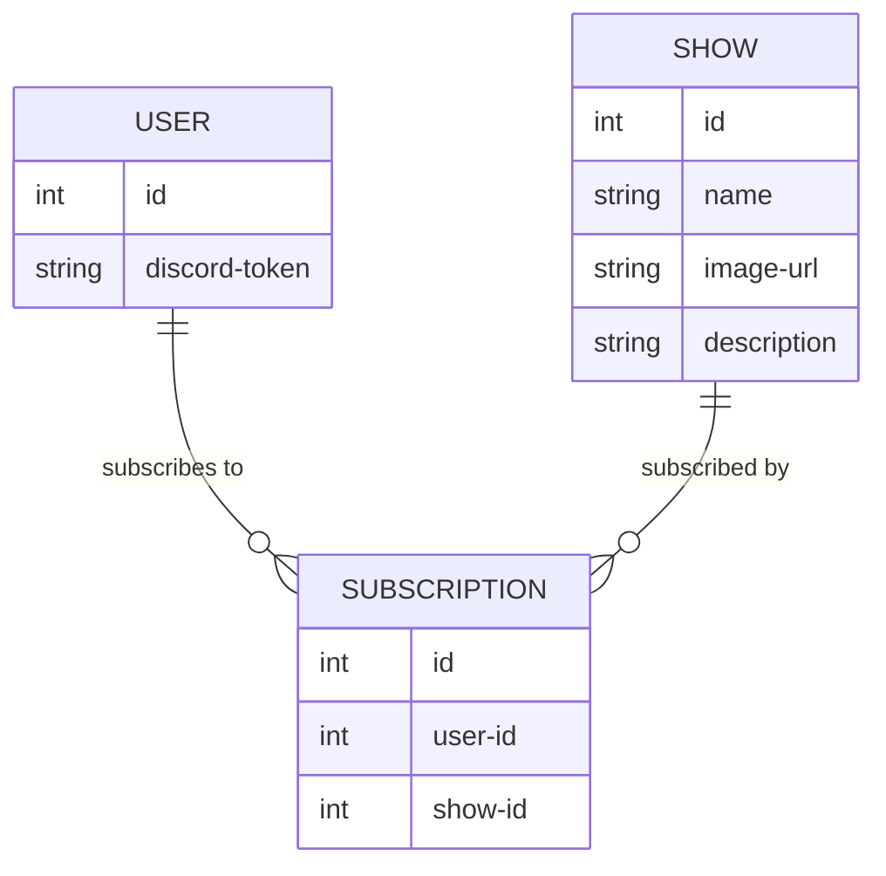
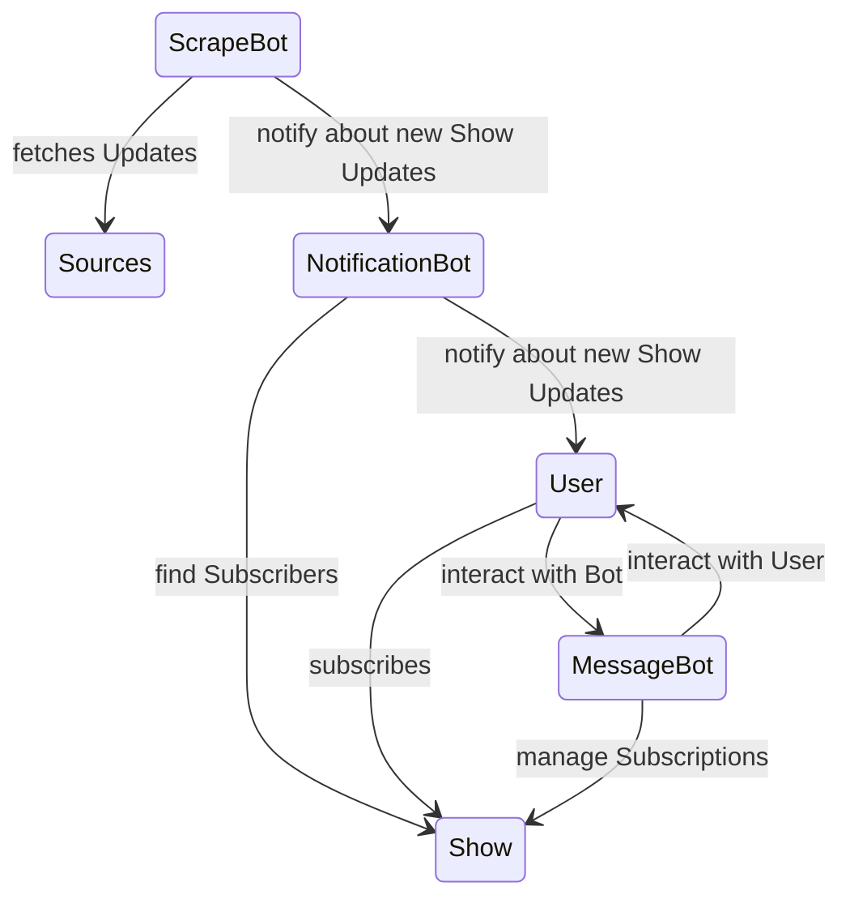

# Momo - Anime Manager

Database Schema

```mermaid
erDiagram
    USER {
        int id
        string discord-token
        }
    SHOW {
        int id
        string name
        string image-url
        string description
        }
    SUBSCRIPTION {
        int id
        int user-id
        int show-id
        }
    USER ||--o{ SUBSCRIPTION : "subscribes to"
    SHOW ||--o{ SUBSCRIPTION : "subscribed by"
```

Domain Model

```mermaid
stateDiagram-v2
    User --> Show : subscribes
    ScrapeBot --> Sources: fetches Updates
    ScrapeBot --> NotificationBot: notify about new Show Updates
    NotificationBot --> Show: find Subscribers
    NotificationBot --> User: notify about new Show Updates
    MessageBot --> User: interact with User
    User --> MessageBot: interact with Bot
    MessageBot --> Show: manage Subscriptions
```